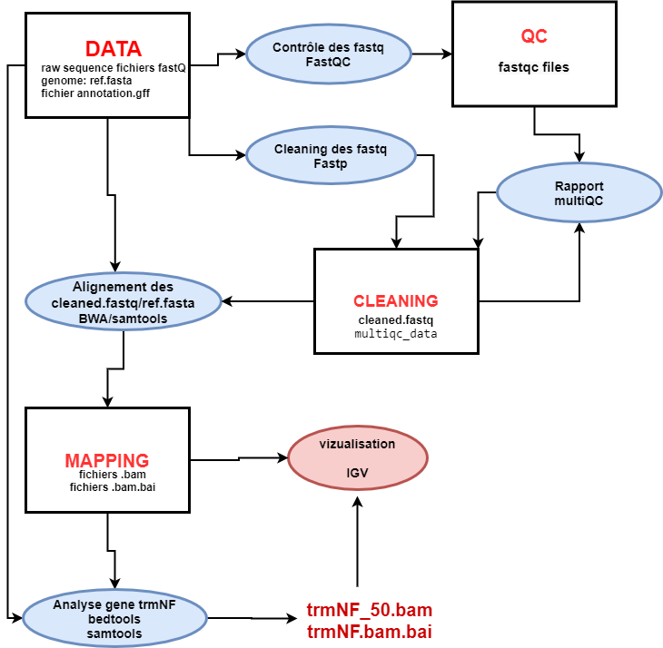
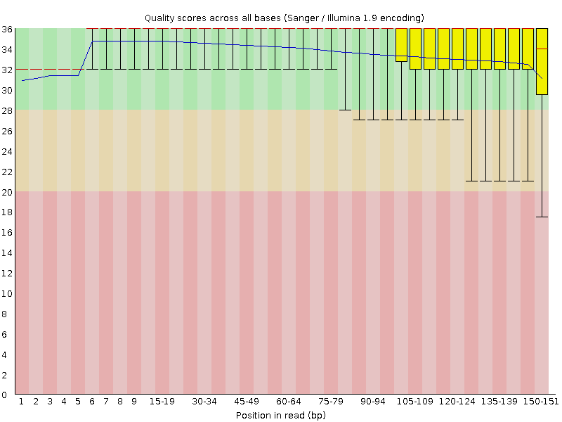
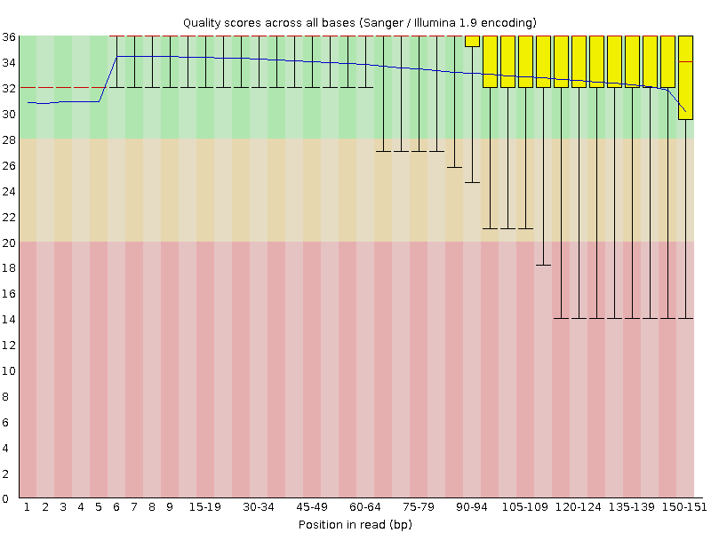
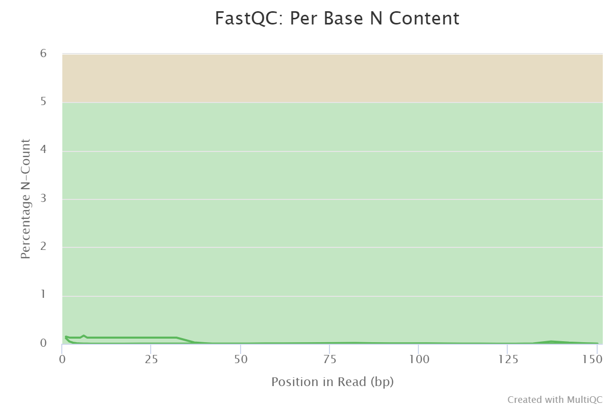
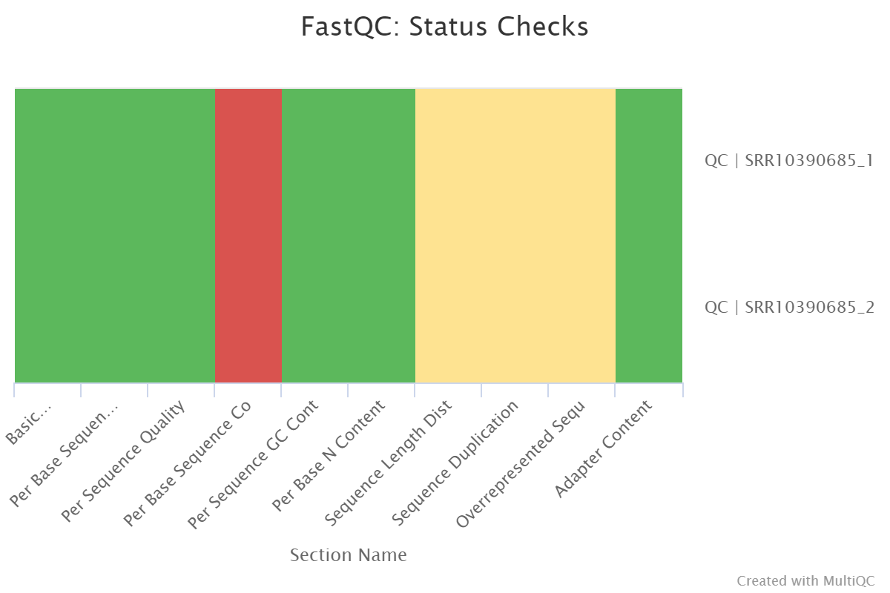
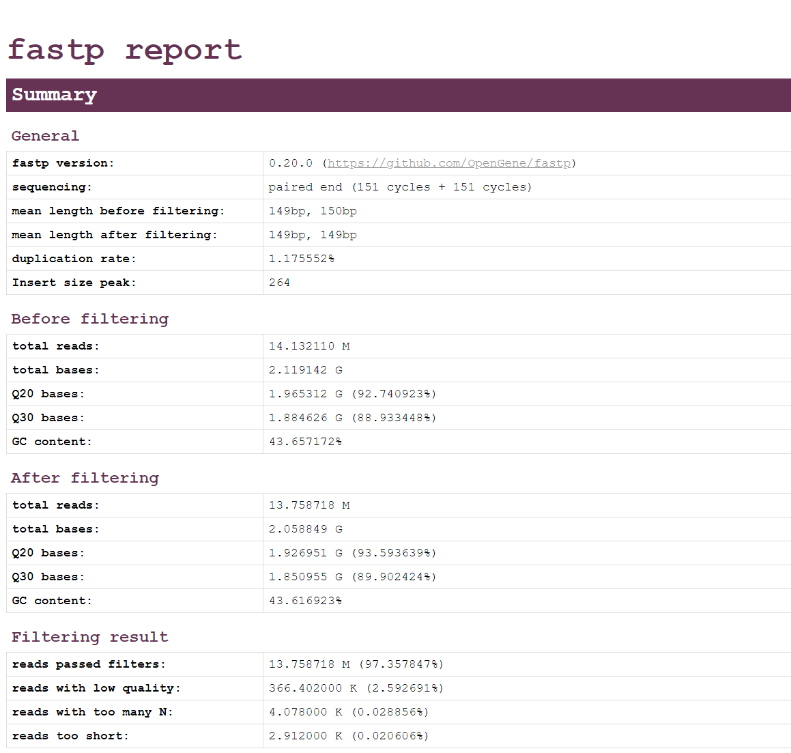
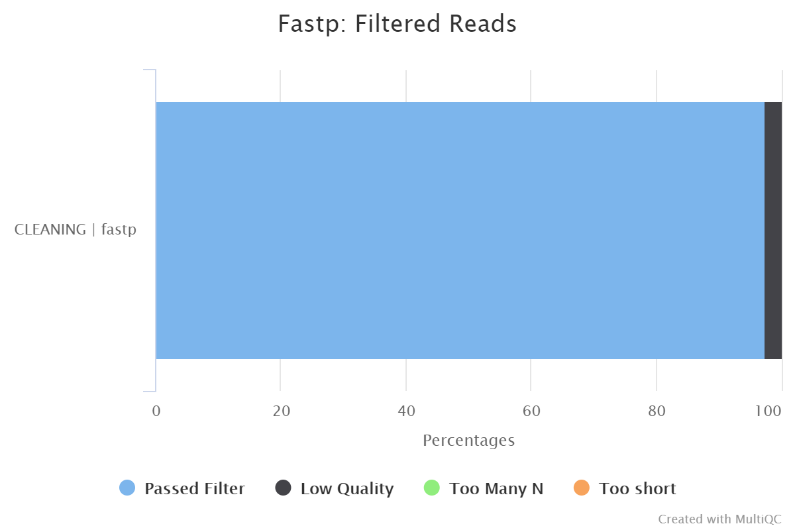
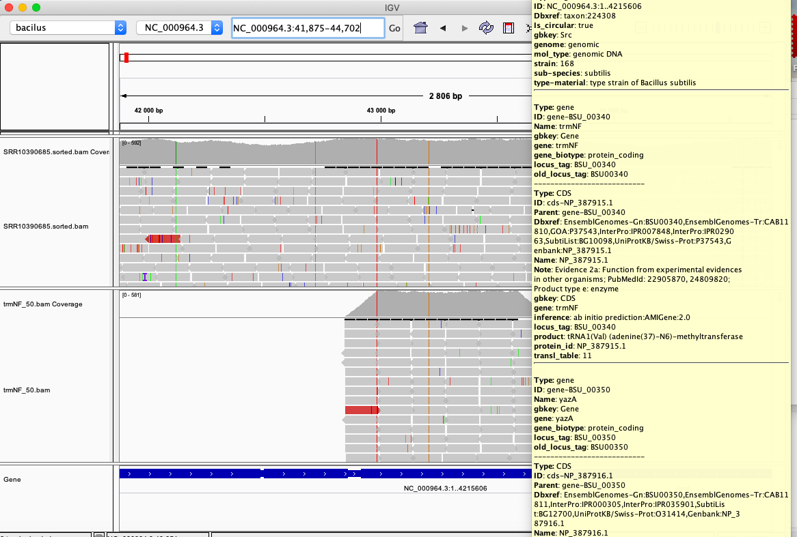

```{r setup, include=FALSE}
knitr::opts_chunk$set(echo = TRUE , comment=NULL)
```

```{r}
library("knitr")
Sys.setlocale ("LC_TIME", "French")
```
# DU-Bii 2020 : Examen final Modules 4 et 5

### Analyse de données de séquançage provenant de Bacillus subtilis . 
(données réléchargés suivant les informations de la publication  "Complete Genome Sequences of 13 Bacillus subtilis Soil Isolates for Studying Secondary Metabolite Diversity" (doi:10.1128/MRA.01406-19)) 

# I- Protocole
## 1 -Caracteristiques des données: 
Les données brutes(run=SRR10390685) correspondent au séquençage d'une des souches de Bacillus subtilis du sol isolée au Danemarque décrites dans l'article. Elles ont été produites avec  illumina NextSeq 500. Elles sont  paired-end avec des reads de 149/150bp. 

Les informations se trouvent sur ces liens:

* run :  <https://trace.ncbi.nlm.nih.gov/Traces/sra/?run=SRR10390685>
* genome de reference <https://www.ncbi.nlm.nih.gov/nuccore/NC_000964>

## 2 -Worflow d'analyse
Les fichiers input (raw data SRR10390685 et fichier de référence gff et fasta de Bacillus subtilis) ont été téléchargés sur le cluster IFB (/shared/projects/dubii2020/csaintruf/miniPunix) avec **sra** ou **wget**. Le contrôle qualité des données des fichiers fastq a été fait avec **fastqc**. La filtration des reads de mauvaise qualité et le trimming des bases adaptateurs présentes dans les reads ont été faits avec **fastp**. L’alignement des reads sur le génome de référence et l’obtention d’1 fichier d’alignement bam et de son index bai ont été réalisé avec **BWA**  et **samtools**. Enfin la recherche des reads couvrant le gene trmNF a été réalisé avec les outils **grep**, **awk** et  **bedtools**. 

Voici le worflow synthétique des traitements effectués: 

* **Figure 1: worflow**

Les rectangles représentent les dossiers du répertoire projet "miniPunix" sur le cluster de l'IFB, les ellipses représentent les traitements et outils utilisés.




# II -Organisation du répertoire projet

En dehors des dossiers DATA, QC, CLEANING,  MAPPING indiqués dans le workflow unfichier  RESULTS est été créé  afin de rassembler les différents autres résultats de l'analyse.
* Path du repertoire projet sur le cluster de l'IFB: /shared/projects/dubii2020/csaintruf/miniPunix
```{bash, eval=FALSE}
mkdir CLEANING data MAPPING MAPPING QC RESULTS
```


* **visualisation du répertoire utilisé avec tree** 
La commande tree va permettre de créer l'arbre du projet qui sera stocké sous forme d'fichier repertoire.txt afin de pouvoir l'afficher sur ce rapport
```{bash, eval=FALSE}
cd /shared/projects/dubii2020/csaintruf/miniPunix
tree > RESULTS/repertoire.txt

```
* Affichage du fichier repertoire.txt
```{bash, eval=TRUE}
cat /shared/projects/dubii2020/csaintruf/miniPunix/RESULTS/repertoire.txt
```

# III -Codes utilisés

## 1 - Téléchargement des données dans le dossier data 
* Téléchargement du Genome de reference NC_000964( fichier gff (annotation) , fichier fasta (sequence NC_000964) ) avec wget

```{bash download_genome_reference, eval=FALSE }
cd /shared/projects/dubii2020/csaintruf/miniPunix/data
wget https://ftp.ncbi.nlm.nih.gov/genomes/all/GCF/000/009/045/GCF_000009045.1_ASM904v1/GCF_000009045.1_ASM904v1_genomic.gff.gz

wget https://ftp.ncbi.nlm.nih.gov/genomes/all/GCF/000/009/045/GCF_000009045.1_ASM904v1/GCF_000009045.1_ASM904v1_genomic.fna.gz 

```
* Téléchargement des fichiers SRR10390685 avec sra puis compression des fichiers obtenus (2 fichiers fastq paire-end: SRR10390685_1.fastq.gz et SRR10390685_2.fastq.gz)

```{bash download_SRR10390685, eval=FALSE}
cd /shared/projects/dubii2020/csaintruf/miniPunix/data
module load sra-tools
srun fasterq-dump -S -p SRR10390685 --outdir . --threads 1
srun gzip *.fastq
```


## 2 -Contrôle qualité des données brutes (reads) et nettoyage des fastq

### Contrôle de la qualité des fastq avec fastqC 
* les lignes de commande se trouvent dans le script fastqc_miniPunix.sh. Affichage du script:
```{bash}
cat /shared/projects/dubii2020/csaintruf/miniPunix/fastqc_miniPunix.sh
```

### Cleaning et controle qualité des fastQ avec fastp 
 Cette étape permettra 
 
 * d'enlever les bases des adapateurs illumina des reads (trimming)
 * de filtrer les reads avec une qualité moyenne >Q20 (99% de base corretement identifié) par fenêtre de 4 bases et >Q15 pour 40% du read et ayant une longueur  >60pb (sachant que la taille attendue des reads est de 150pb)

```{bash fastP , eval=FALSE}
cd /shared/projects/dubii2020/csaintruf/miniPunix/
module load fastp

srun --cpus-per-task 8 fastp --in1 data/SRR10390685_1.fastq.gz --in2 data/SRR10390685_2.fastq.gz -l 60 --out1 CLEANING/SRR10390685_cleanfiltered_1.fastq.gz --out2 CLEANING/SRR10390685_cleanfiltered_2.fastq.gz \
--unpaired1 CLEANING/SRR10390685_1_singles.fastq.gz --unpaired2 CLEANING/SRR10390685_2_singles.fastq.gz -w 1 -j CLEANING/fastp.json -h CLEANING/fastp.html 
```
### Obtention d'un rapport multiqc à partir des résultats  fastqC et fastP 
On utilise MultiQC pour produire un rapport détaillé de qualités à partir des contrôles qualités effectués par fastqC et également fastP
```{bash multiqc, eval=FALSE }
cd /shared/projects/dubii2020/csaintruf/miniPunix/
module load multiqc
multiqc -d . -o CLEANING
```

## 3 -Alignement des reads sur le génome de reférence
* Ulisation de l'outil bwa  pour effectuer l'alignement
 
```{bash bwa, eval=FALSE }
cd /shared/projects/dubii2020/csaintruf/miniPunix/
#decompression du fichier de reference fasta 
gunzip data/GCF_000009045.1_ASM904v1_genomic.fna.gz
#creation d'un index bwa pour le génome de référence
module load bwa
module load samtools 
srun bwa index data/GCF_000009045.1_ASM904v1_genomic.fna
#mapping avec l'outil bwa en mode paired end puis conversion du fichier sam obtenu en bam avec samtools
srun --cpus-per-task=33 bwa mem /shared/projects/dubii2020/csaintruf/miniPunix/data/GCF_000009045.1_ASM904v1_genomic.fna CLEANING/SRR10390685_cleanfiltered_1.fastq.gz CLEANING/SRR10390685_cleanfiltered_2.fastq.gz -t 32 | samtools view -hbS - > MAPPING/SRR10390685.bam

```

### Création d'un fichier de statistique d'alignement avec samtools flagstat
* fichier de sortie **statistique.txt**

```{bash statistique, eval=FALSE }
module load samtools
srun samtools flagstat MAPPING/SRR10390685.bam > RESULTS/statistique.txt
```

## 4 -Création du fichier trmNF_50.bam contenant les reads chevauchant à au moins 50% le gène trmNF 
* Tri et indexation du fichier SRR10390685.bam (permettra la visualisation sur IGV)
```{bash sortbam, eval=FALSE  }
module load samtools
srun samtools sort MAPPING/SRR10390685.bam -o MAPPING/SRR10390685.sorted.bam
srun samtools index MAPPING/SRR10390685.sorted.bam
```
* Extraction de la séquence du géne trmNF à l'aide de grep et awk du fichier de reference .gff

La commande suivante permettra de sélectionner la ligne du fichier d'annotation de référence .gff contenant "trmNf"  et comprenant "gene" au niveau de la colonne 3 (colonne feature) et de la stocker dans un fichier appellé **trmNF_gene.gff**

```{bash trmNFgff, eval=FALSE }
cd /shared/projects/dubii2020/csaintruf/miniPunix/
grep trmNF data/GCF_000009045.1_ASM904v1_genomic.gff | awk '$3=="gene"' > RESULTS/trmNF_gene.gff
```

* Selection des reads chevauchant à au moins 50% le gène trmNF avec bedtools interesect. 

L'option interesect -f -0.50 va permettre de fixer le % d'homologie de séquence à 50% minimun. Les reads sélectionnés sont stockés dans un fichier appelé **trmNF_50.bam**
```{bash intersect, eval=FALSE }
cd /shared/projects/dubii2020/csaintruf/miniPunix/
module load bedtools
srun bedtools intersect -a MAPPING/SRR10390685.sorted.bam -b RESULTS/trmNF_gene.gff  -f 0.50  > RESULTS/trmNF_50.bam
# création d'un index pour trmNF_50.bam
srun samtools index RESULTS/trmNF_50.bam
```


# IV -Résultats et analyses  
## 1 -Contrôle qualité des données brutes (reads)
### **Question:La qualité des bases vous paraît-elle satisfaisante ? Pourquoi ?**
Les résultats des analyses fastQC et fastp sont les suivant:

 * 94% du  fichier SRR10390685_1.fastq.gz  ont un phred score > Q20 (Figure 2 et 5)
 * 92% du  fichier SRR10390685_1.fastq.gz  ont un phred scor > Q20 (Figure 3 et 5)
 * Le pourcentage de N (base non identifié) est faible (0,17% maximun). Ceux-ci sont observés essentiellement en début de séquence. (Figure 4 et 5)
 
 (un phred score Q20 signifie que 99% de bases correctement identifiés)
 
#### **Réponse:Ces résultats sont donc tout à fait satisfaisants comme l'indique également le statut vert Figure 5**. 

* **Figure 2 :  Qualité des bases du fichier  SRR10390685_1.fastq**

 
 * **Figure 3 :  Qualité des bases du fichier  SRR10390685_1.fastq**
 

* **Figure 4: contenu en N** 

 
 
* **Figure 5 Contrôle qualité globale des fatsq (figure obtenu avec multiQC)**
 
 
 
 
### **Question: Quelle est la profondeur de séquençage (calculée par rapport à la taille du génome de référence) ?**
La profondeur peut se calculer avec la formule suivante:
Depth=N*L/G  où  N=nombre de read;  L=read size;  G= taille du génome de référence
Valeurs observées:

* G=4215606 bp
* L = 149 bp
* G=  4215606 bp
* N= 	14 132110


Calcul: 
```{r}
G=4215606 
L = 149 
G=  4215606 
N= 	14132110
Depth=N*L/G
Depth
```
#### **Réponse:La profondeur de séquençage est de 500**


## 2 -Nettoyage des reads
### **Question: Quel pourcentage de reads sont filtrés et pourquoi ?**

#### **Réponse: D'après les analyses fastP,  97,4% des reads ont répondu aux exigences de qualité (rapport fastp et Figure 6)**.

Pour rappel: il s'agit des reads avec une qualité moyenne >Q20 (99% de base corretement identifié) par fenêtre de 4 bases et >Q15 pour 40% du read ainsi que la filtration des reads d'une longueur  >60pb ). Les reads non retenus sont essentiellement des reads de qualité insuffisante (2,5%) . 4098 reads ont trop de N (bases non identifiables) 

#### **Rapport fastp**



* **Figure 6 : % de reads filtrés**
 


## 3 -Alignement des reads contre le génome de reférence
### **Question: Quel est le % de reads pairés alignés ?**
Affichage du fichier statistique.txt créer avec samtools flagstat
```{bash}
cd /shared/projects/dubii2020/csaintruf/miniPunix/
cat RESULTS/statistique.txt
```
D'après le fichier statistique.txt obtenue avec samtools:

#### **Réponse: Le % de reads pairés alignés dans le fichier bam est de 94%**.

## 3 -Extraire dans un fichier BAM les reads chevauchant à au moins 50% le gène trmNF
Le fichier trmNF_50.bam contenant les reads chevauchant à au moins 50% le gène trmNF a été réalisé suivant la procédure décrite ci-dessus (chapitre Codes utilisés). Pour vérifier que ce fichier correspond bien à la région recherchée, il a été ouvert dans IGV en zoomant sur la région correspondant au gène trmNF (position 42917 - 43660 sur le génome NC_000964.3).
Effectivement les reads du fichier trmNF_50.bam couvrent bien le gène trmNF.  

*  Les coordonnées de trmNF se trouve dans le fichier trmNF_gene.gff. Affichage du fichier trmNF_gene.gff:
```{bash}
cat /shared/projects/dubii2020/csaintruf/miniPunix/RESULTS/trmNF_gene.gff
```


### **Figure 7: IGV visualisation du fichier trmNF_50.bam**




```{r}

```

